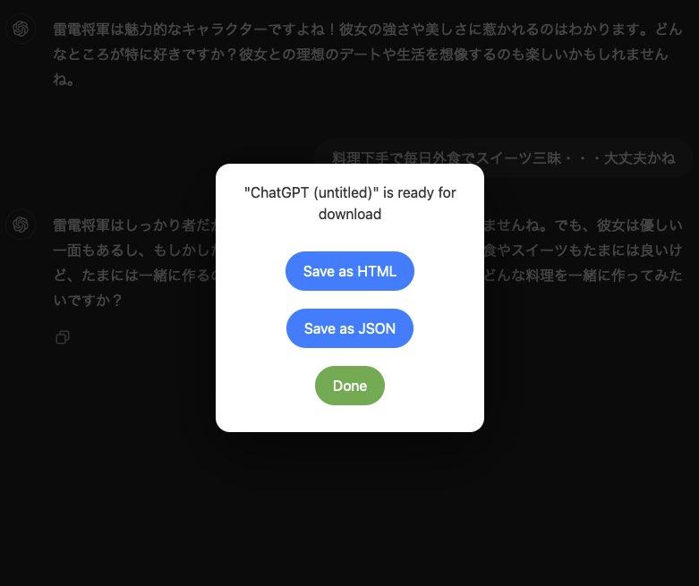

Download ChatGPT chat history into JSON or HTML file with images.

- Saves user-provided images as base64 chunks
- Retains ChatGPT markdown response
- Downloading of DallE images might need page-reloading

To use, copy the content of [bookmarklet.js](build/bookmarklet.js) and paste it to the URL box of a new bookmark.

